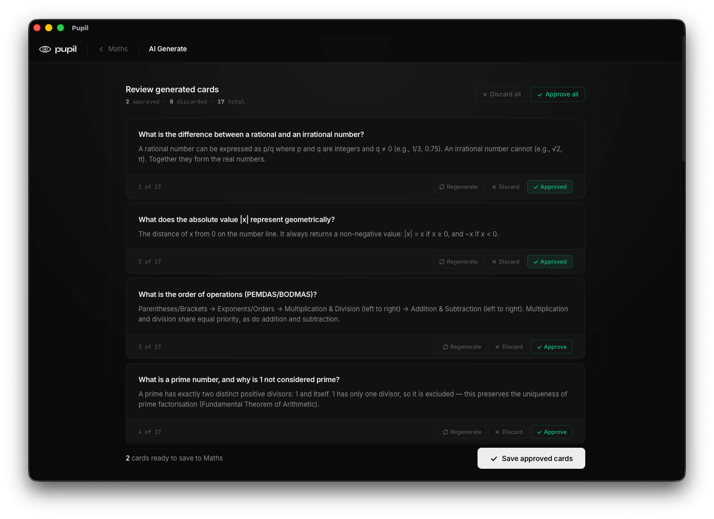
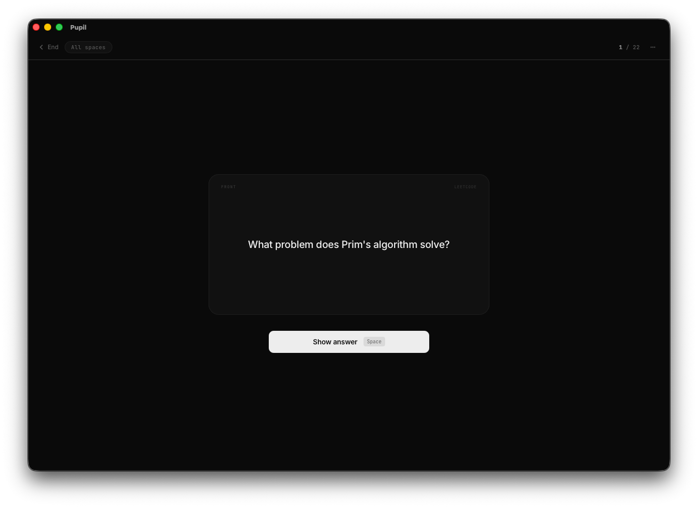
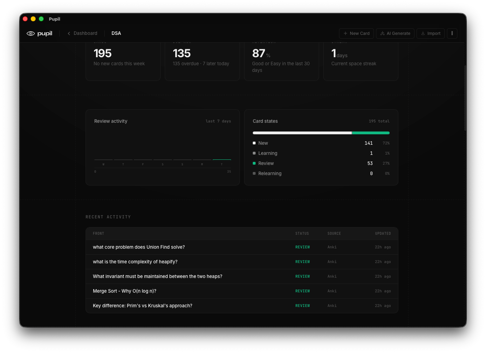
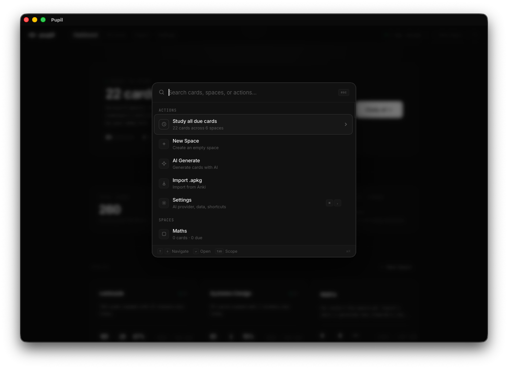
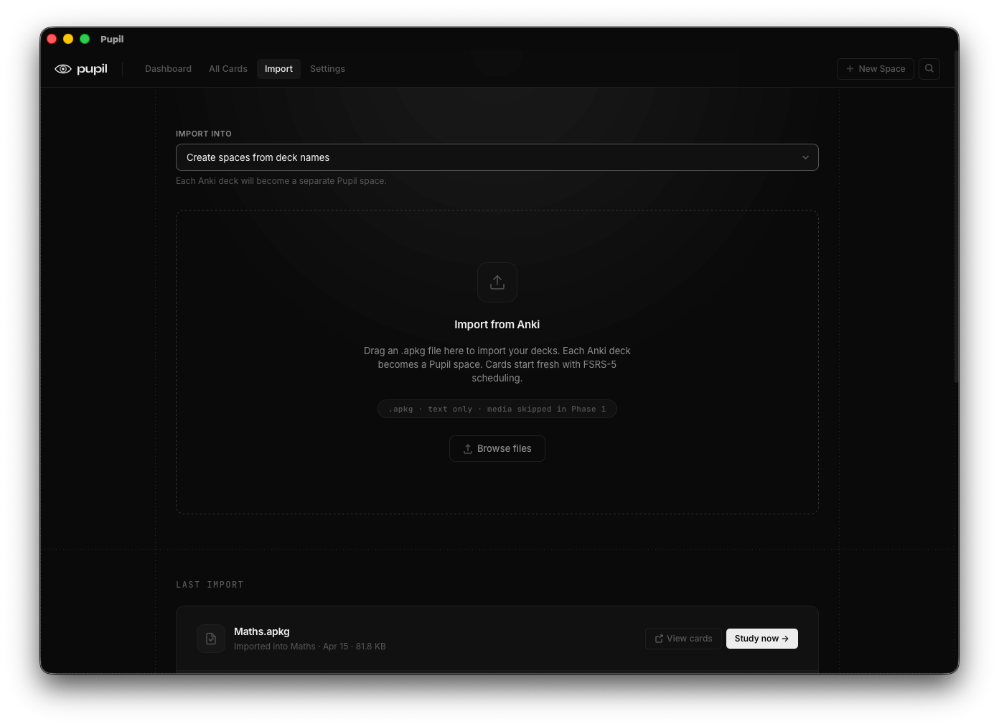

# Pupil

Pupil is a local-first flashcard app for people who want the power of spaced repetition without the friction that usually comes with it.

Create focused study spaces. Import Anki decks. Generate cards from any topic with AI. Study with FSRS. Everything stays on your machine.

## Screenshots

<table>
<tr>
<td width="50%" valign="middle">

### Generate cards from a topic

Describe a topic, pick a space and options, then review generated cards before saving anything.

</td>
<td width="50%">

</td>
</tr>
<tr>
<td width="50%" valign="middle">

### Approve cards before they save

Regenerate, discard, or approve each draft, then save only the cards you want into the space.

</td>
<td width="50%">

</td>
</tr>
<tr>
<td width="50%" valign="middle">

### Study one card at a time

Question first—tap Show answer or press Space when you are ready.

</td>
<td width="50%">

</td>
</tr>
<tr>
<td width="50%" valign="middle">

### Review with FSRS scheduling

Rate recall with Again, Hard, Good, or Easy so FSRS schedules the next review.

</td>
<td width="50%">

</td>
</tr>
<tr>
<td width="50%" valign="middle">

### See how a space is doing

Due counts, retention, review activity, FSRS card states, and recent cards for one space.

</td>
<td width="50%">

</td>
</tr>
<tr>
<td width="50%" valign="middle">

### Jump anywhere from ⌘K

Search cards, spaces, or actions—study due cards, generate, import, or open settings from one overlay.

</td>
<td width="50%">

</td>
</tr>
<tr>
<td width="50%" valign="middle">

### Bring Anki decks home

Drag an `.apkg` file in; each Anki deck can become its own Pupil space with fresh FSRS scheduling.

</td>
<td width="50%">

</td>
</tr>
</table>

## Get Pupil

Download the latest installer for macOS, Windows, or Linux from [GitHub Releases](https://github.com/balazsotakomaiya/pupil/releases/latest). No account is required.

Your cards, review history, and settings stay on your device. If you use AI generation, add your own OpenAI-compatible or Anthropic API key in Settings; it is stored securely on your machine.

## Why Pupil

Most flashcard tools force a tradeoff.

- Anki is powerful, yet deeply outdated visually, clunky, and complex
- AI can generate content fast but usually lives and stays in your chat history on ChatGPT, Claude, or Gemini.
- Modern study tools hide the good stuff behind subscriptions and lock you in.

Pupil is built to close that gap: fast card creation, a clean study flow, serious scheduling, and no account required. It is free and open source.

It is also designed to be more present in your day than Anki typically is — subtle reminders, streaks that keep momentum going, and stats that surface weak spots before they become blind spots.

## What it does

- Organize knowledge into named spaces
- Create cards manually with a desktop-first editor
- Import `.apkg` decks from Anki
- Generate cards from a topic using any OpenAI-compatible or Anthropic model
- Review AI-generated cards before they land in your library
- Study per-space or across your full collection
- Schedule reviews with FSRS
- Export review history as CSV
- Store everything locally in SQLite — no account, no sync

## Principles

Pupil is designed around one idea: studying should feel sharp, calm, and immediate.

- Local-first by default
- Fast enough to go from idea to deck in under a minute
- Structured for daily use, not just card authoring
- Opinionated UI

## Product direction

Pupil is growing beyond the desktop without giving up its local-first foundation.

- Optional cloud sync for people who study across devices
- A mobile app for keeping reviews within reach wherever you are
- Assistant workflows, including a possible MCP bridge so tools like Claude or ChatGPT could push cards directly into Pupil

## Contributing

Want to help build Pupil? Setup, conventions, and the pull-request checks are in [CONTRIBUTING.md](CONTRIBUTING.md). Participation is governed by our [Code of Conduct](CODE_OF_CONDUCT.md).

Found a security issue? Please report it privately — see [SECURITY.md](SECURITY.md).

Release notes live in [CHANGELOG.md](CHANGELOG.md).

## License

Pupil is available under the MIT License. You can use, modify, distribute, and sell software based on it, as long as you keep the copyright notice and license text. See [LICENSE](LICENSE).
