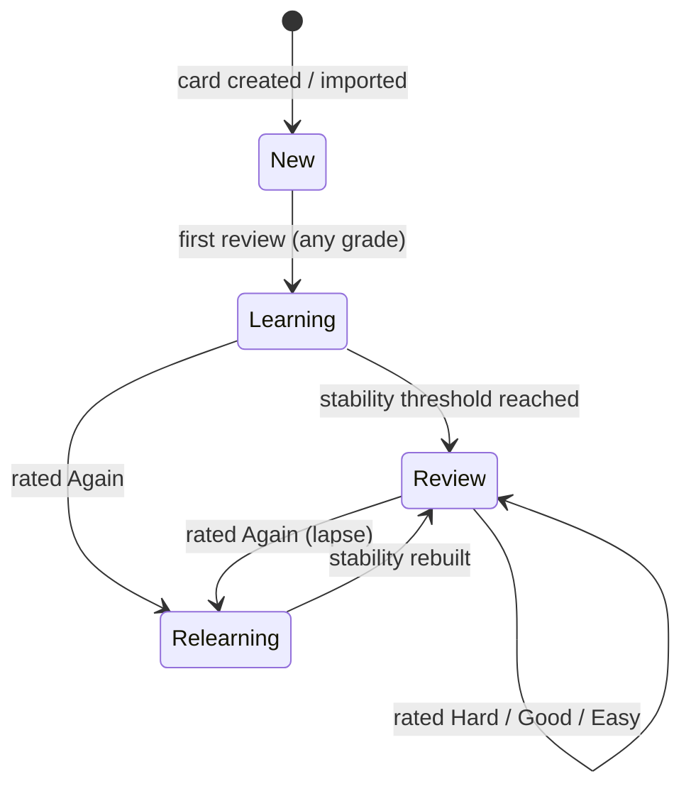
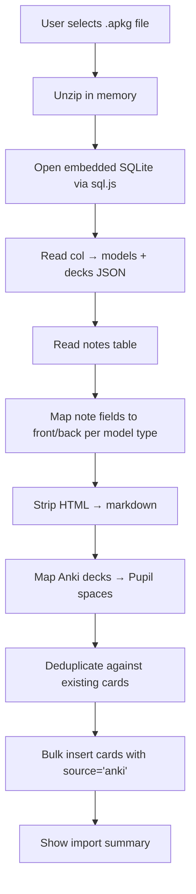
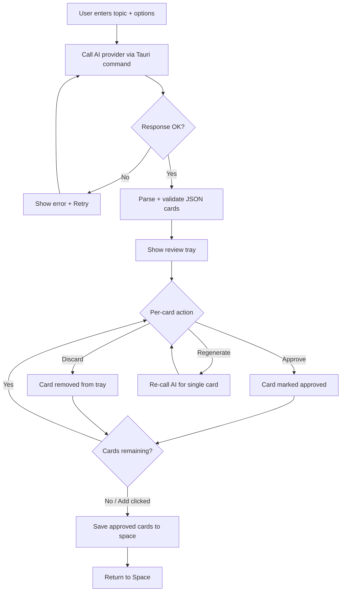
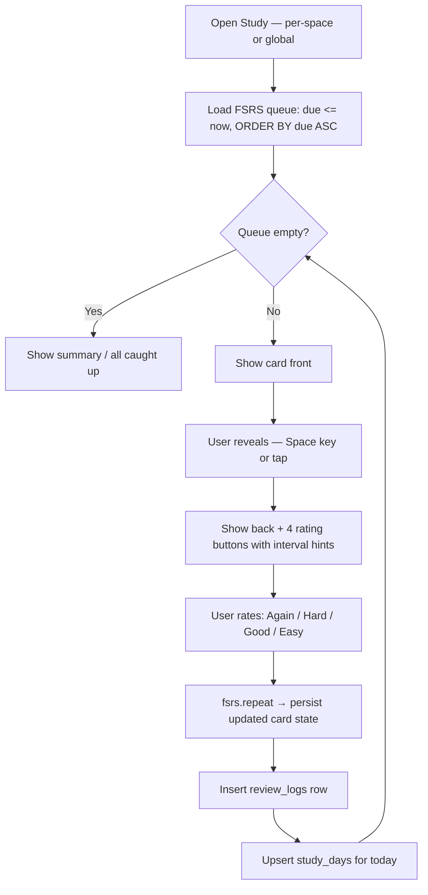
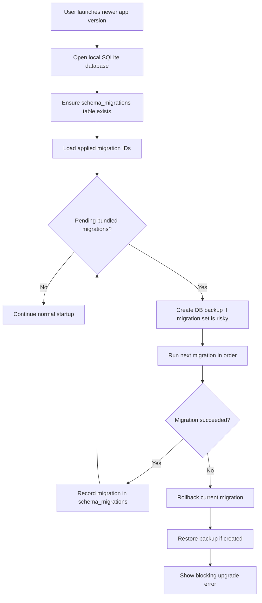

# Phase 1 — Pupil Core App

## Status

 In progress

Chunk tracker:
- [x] Chunk 0. Monorepo scaffold + site landing page
- [x] Chunk 1. SQLite schema + migration layer
- [x] Chunk 2. Spaces CRUD
- [x] Chunk 3. Manual card creation + storage
- [x] Chunk 4. Anki import (.apkg)
- [ ] Chunk 5. AI card generation + approval flow
- [x] Chunk 6. Study session + FSRS engine (per-space + global)
- [x] Chunk 7. Stats (per-space + global)
- [x] Chunk 8. Streaks + daily check-in
- [ ] Chunk 9. AI provider settings

---

## Objective

Ship a local-first flashcard app (Mac + Web, mobile stretch) that:
- Lets users create and organize cards into named spaces
- Imports existing Anki decks (`.apkg` files) so users aren't starting from zero
- Uses AI to batch-generate cards from a topic prompt, with per-card approve/discard/regenerate
- Drives study sessions with FSRS-5 spaced repetition — per-space or across all spaces
- Records per-card difficulty ratings (Again / Hard / Good / Easy)
- Tracks streaks and surfaces per-space and global statistics

---

## Current codebase state

- The repo currently contains the monorepo root, Turborepo config, the shipped marketing site in `apps/site`, and the in-progress desktop app in `apps/app`.
- `apps/site` is a Vite + React landing page.
- `packages/` exists but is empty. There is no `packages/core` package yet.
- `apps/app` now includes the Tauri v2 + React scaffold, the initial SQLite schema migration runner, and spaces CRUD backed by the local database.
- Several later sections in this document still describe the target Phase 1 architecture that has not been implemented yet.
- Important mismatch from the previous draft: shared FSRS helpers, DB helpers, and prompt builders are not implemented yet and must be created as part of the app work rather than assumed as existing infrastructure.

---

## Open Questions

1. **Anki import: how deep?**
   Should we support media (images/audio) embedded in `.apkg` files, or text-only cards in Phase 1?
   **Default:** Text-only. Media import is Phase 2.

2. **License choice?**
   MIT or Apache-2.0?
   **Default:** MIT.

3. **Should `packages/core` exist in Phase 1 at all?**
  This affects whether we add an extra package boundary before there is more than one real app consumer.
  **Default:** No. Keep Phase 1 domain code in `apps/app` and extract later only if a second consumer appears or the domain layer becomes meaningfully large.

---

## Decision Ledger

- **Decision:** SQLite via `@tauri-apps/plugin-sql` as the sole local store. Single `.db` file in the Tauri app-data directory.
  **Effect:** Fast, queryable, trivially portable. Enables a paid sync/cloud layer later without changing the data model.

- **Decision:** User-supplied API key, called directly with the OpenAI-compatible API. Recommended model defaults: **Claude Sonnet 4.6**, **Claude Opus 4.6**, **GPT-5.4**. Free-text custom model field. Configurable `base_url` for self-hosted or Pupil-hosted endpoints.
  **Effect:** No backend. API key stored in Tauri Stronghold, only accessed from Rust sidecar. Future: swap `base_url` for a Pupil-hosted proxy to add a hosted tier without a client update.

- **Decision:** **Tauri v2 + React** for the desktop app. Mobile (iOS/Android) is Phase 2 via Tauri's mobile extensions.
  **Effect:** One repo, one UI codebase, web + desktop + (later) mobile from the same React tree.

- **Decision:** **FSRS-5** via `ts-fsrs` (TypeScript, MIT). No SM-2.
  **Effect:** Best-in-class retention scheduling. Runs entirely in TypeScript; only card state is persisted to SQLite.

- **Decision:** **Bun workspaces + Turborepo**. Bun replaces Node for all tooling.
  **Effect:** Faster installs and script execution. `package.json` `workspaces` field is the source of truth.

- **Decision:** OSS project on GitHub under an open-source license.
  **Effect:** Community contributions welcome. Binary releases via GitHub Releases + CI.

- **Decision:** Anki import (`.apkg`) in Phase 1.
  **Effect:** Users can migrate existing decks immediately instead of recreating from scratch. Lowers adoption barrier significantly.

- **Decision:** Study supports both per-space and global (all due cards across spaces) modes.
  **Effect:** Users can drill a single topic or do a mixed review across everything. Global study pulls from all spaces, ordered by due date.

- **Decision:** Do not create `packages/core` in Phase 1.
  **Effect:** Keep the codebase simpler while there is only one real product app. FSRS helpers, migration metadata, prompt builders, import parsing, and shared types live inside `apps/app` for now. Extract them later only on demonstrated need.

- **Decision:** Do not use a full ORM for Phase 1. Use SQLite with forward-only SQL migrations plus a thin TypeScript data-access layer.
  **Effect:** We keep complete control over the on-disk schema, generated SQL stays predictable for a desktop local-first app, and version upgrades are easier to reason about. If query composition becomes painful later, add a query builder, not a record-style ORM.

- **Decision:** App upgrades run schema migrations automatically before the renderer is allowed to use the database.
  **Effect:** New releases can evolve the schema safely without asking the user to perform manual upgrade steps. Migration failures block startup for the database-dependent UI and preserve the pre-upgrade database state.

---

## Business

**Objective:** Give knowledge workers and students a local-first, AI-augmented flashcard system that makes learning faster and more consistent than Anki, Quizlet, or manual notes.

**Problem being solved:**
- Anki is powerful but has terrible UX and a steep learning curve.
- Quizlet is frictionless but lacks real spaced repetition.
- Creating cards manually is slow; most people already know what topic they want to study.
- AI tools like ChatGPT can generate flashcards but lack a study loop.
- Switching from Anki means losing years of card history without an import path.

**What must be true after Phase 1 ships:**
- A user can open the app, create a Space, generate AI cards about any topic in under 60 seconds, and immediately begin an FSRS-driven study session.
- A user with an existing Anki collection can import their `.apkg` file and continue studying in Pupil.
- Study works per-space (focused drill) or globally (mixed review across all spaces).
- The app stores all data locally with no account required.
- Streaks motivate daily return.

**Non-goals for Phase 1:**
- No cloud sync or account system.
- No collaboration or sharing.
- No mobile build (Phase 2 stretch).
- No subscriptions or billing.
- No media (images/audio) import from Anki (Phase 2).

---

## Functionality

### Spaces
- Create, rename, delete named spaces.
- Each space has a card count, due-today count, and current streak.
- Deleting a space cascades to all its cards, review logs, and study days.

### Manual Card Creation
- Create cards with front/back text fields and optional tags. Markdown in both fields.
- Save creates the card with FSRS `state: New` via `createEmptyCard()`.
- Edit and delete individual cards.

### Anki Import (.apkg)

Import from Anki's export format (`.apkg` = ZIP containing a SQLite database + media):

- User selects a `.apkg` file.
- App reads the embedded SQLite database (`collection.anki21` or `collection.anki2`).
- Extracts notes and cards. Maps Anki fields to Pupil `front`/`back`:
  - Basic note type: field[0] → front, field[1] → back
  - Cloze note type: convert cloze syntax `{{c1::answer}}` → front uses cloze deletion, back has the full text
  - Other note types: field[0] → front, remaining fields joined → back
- Each Anki deck maps to a Pupil Space (created if it doesn't exist).
- Imported cards get `source: 'anki'` and `state: New` (FSRS history is not transferred — fresh start with FSRS-5).
- Tags from Anki notes are preserved in the `tags` field.
- Duplicate detection: skip cards where both front and back text exactly match an existing card in the target space.
- Media files (images, audio) are skipped in Phase 1. HTML in card content is stripped to plain text (or minimal markdown).

### AI Batch Generation

- User provides: topic prompt, card count (default 10), difficulty (Beginner / Intermediate / Advanced), card style (Concept / Q&A / Cloze).
- AI provider is called from the Rust sidecar with the structured prompt (see AI Generation section).
- Response is parsed and validated: each card must have non-empty `front` and `back`.
- Cards are shown in a review tray. Per-card actions: Approve, Discard, Regenerate. Bulk actions: Approve All, Discard All.
- Approved cards are saved to the space as `state: New`.
- Failed AI calls show an inline error with retry.

### Study Session

Two entry points:
1. **Per-space study** — study due cards within a single space.
2. **Global study** — study all due cards across every space, interleaved by due date.

Session flow:
- Load FSRS queue: all cards where `due <= now`, sorted by `due ASC` (most overdue first).
- Show card front → user reveals → show back + four rating buttons (Again / Hard / Good / Easy).
- Each rating button shows the next review interval before the user taps (pre-computed from `fsrs.repeat()`).
- Rating persists the updated FSRS state, logs a `review_logs` row, and writes a `study_days` row for today.
- Session ends when queue is empty. Show summary: cards studied, retention estimate, next due date.
- User can exit early; progress on rated cards is saved.
- Keyboard shortcuts: Space = reveal, 1/2/3/4 = rate.

### Stats

**Per-space:**
- Card counts by state (New / Learning / Review / Relearning)
- Cards due today / overdue
- Retention rate (% of reviews rated Good or Easy in last 30 days)
- Current streak

**Global (home screen):**
- Total cards across all spaces
- Total studied today
- Global streak
- Total due today

### Streaks
- A streak increments if at least 1 card is studied during a calendar day (local time).
- Per-space and global streaks tracked separately via `study_days` table.
- On app open with due cards: show a prompt ("N cards due today").
- No push notifications (Phase 2).

### AI Provider Settings
- API key: stored in Tauri Stronghold, never logged, never sent to renderer.
- Base URL: defaults to `https://api.openai.com/v1` (OpenAI-compatible). Overridable for Anthropic, Ollama, or future Pupil proxy.
- Model: dropdown with recommended defaults (`claude-sonnet-4-6`, `claude-opus-4-6`, `gpt-5.4`) + free-text field.
- Test connection: fires a minimal prompt, shows success/error.
- Advanced: max tokens, temperature.

---

## Technical

### Stack

| Layer | Choice | Notes |
|---|---|---|
| App shell | Tauri v2 | Native binary (`.dmg`, `.exe`, `.deb`); Rust sidecar for SQLite, secrets, AI calls |
| UI framework | React 19 + Vite | Design from `DESIGN.md` |
| Styling | CSS | Raw CSS variables from `DESIGN.md`. No Tailwind. |
| Spaced repetition | `ts-fsrs` (FSRS-5) | TypeScript; scheduler in-process, only state persisted |
| Database | SQLite via `@tauri-apps/plugin-sql` | Single `.db` file |
| AI calls | OpenAI-compatible REST | Rust sidecar makes the call; key never touches renderer |
| Secret storage | `@tauri-apps/plugin-stronghold` | API key encrypted at rest |
| Anki import | `sql.js` (SQLite in WASM) | Reads `.apkg`'s embedded SQLite in the renderer |
| Runtime / tooling | Bun | All scripts, installs, dev tooling |
| Monorepo | Bun workspaces + Turborepo | `package.json` `workspaces` field |
| Site | React + Vite (static) | `DESIGN.md`; deployed to Vercel/Netlify |

### Package Boundaries

Phase 1 should use one app package for product code: `apps/app`.

Keep inside `apps/app` for now:
- FSRS scheduling helpers and types
- SQL schema definitions and migration registry metadata
- validation and parsing helpers
- AI prompt builders and response validators
- Anki import parsing and HTML-to-markdown normalization
- product-specific TypeScript domain types used by the renderer and tests

Do not split these into `packages/core` unless one of these becomes true:
- a second real product consumer appears
- the domain layer grows enough that extraction clearly improves maintainability
- tests or tooling need a reusable package boundary for speed or isolation

### Monorepo Layout

```
pupil/
├── apps/
│   ├── app/          # Tauri v2 + React — desktop binary + web build
│   └── site/         # Vite + React — landing page (static)
├── packages/         # Shared workspace packages
├── docs/
│   └── PHASE_1_SPEC.md
├── DESIGN.md
├── package.json      # Bun workspace root
└── tsconfig.base.json
```

This target layout now exists in the repo. `apps/app` is scaffolded and already carries the Chunk 1-2 foundation, while later sections below still describe the remaining work for the rest of Phase 1.

### Database Access Strategy

Phase 1 should be SQL-first, not ORM-first.

- Use versioned SQL migration files as the source of truth for schema changes.
- Keep a small data-access layer in TypeScript for query execution and row mapping.
- Prefer explicit SQL for study queues, stats, streaks, and import deduplication.
- Keep SQL close to the domain operation that owns it instead of generating it indirectly through models.

Why not an ORM here:
- The schema is small and relationally simple.
- The app is local-first and ships an embedded SQLite file, so on-disk compatibility matters more than developer convenience abstractions.
- Review queues, aggregates, and migration safety are easier to inspect with explicit SQL.
- Tauri already introduces a platform boundary; adding a full ORM on top would increase moving parts without solving a hard problem yet.

If the query surface grows materially later, use a typed query builder or generated row types while keeping migrations and schema ownership SQL-first.

### Data Model

```sql
-- Spaces
CREATE TABLE spaces (
  id         TEXT PRIMARY KEY,   -- nanoid
  name       TEXT NOT NULL,
  created_at INTEGER NOT NULL,
  updated_at INTEGER NOT NULL
);

-- Cards
CREATE TABLE cards (
  id             TEXT PRIMARY KEY,
  space_id       TEXT NOT NULL REFERENCES spaces(id) ON DELETE CASCADE,
  front          TEXT NOT NULL,
  back           TEXT NOT NULL,
  tags           TEXT,             -- JSON array of strings
  source         TEXT NOT NULL DEFAULT 'manual', -- 'manual' | 'ai' | 'anki'
  -- FSRS-5 fields (mirrors ts-fsrs Card type)
  state          INTEGER NOT NULL DEFAULT 0,  -- 0=New 1=Learning 2=Review 3=Relearning
  due            INTEGER NOT NULL,            -- Unix ms
  stability      REAL    NOT NULL DEFAULT 0,
  difficulty     REAL    NOT NULL DEFAULT 0,
  elapsed_days   INTEGER NOT NULL DEFAULT 0,
  scheduled_days INTEGER NOT NULL DEFAULT 0,
  reps           INTEGER NOT NULL DEFAULT 0,
  lapses         INTEGER NOT NULL DEFAULT 0,
  last_review    INTEGER,                     -- Unix ms, nullable
  created_at     INTEGER NOT NULL,
  updated_at     INTEGER NOT NULL
);

CREATE INDEX idx_cards_queue ON cards (space_id, state, due);

-- Review log (for stats + future FSRS optimizer)
CREATE TABLE review_logs (
  id             TEXT PRIMARY KEY,
  card_id        TEXT NOT NULL REFERENCES cards(id) ON DELETE CASCADE,
  space_id       TEXT NOT NULL,
  grade          INTEGER NOT NULL,  -- 1=Again 2=Hard 3=Good 4=Easy
  state          INTEGER NOT NULL,  -- card state BEFORE this review
  due            INTEGER NOT NULL,
  elapsed_days   INTEGER,
  scheduled_days INTEGER,
  review_time    INTEGER NOT NULL   -- Unix ms
);

CREATE INDEX idx_review_logs_stats ON review_logs (space_id, review_time);

-- Streak tracking
CREATE TABLE study_days (
  space_id TEXT,                    -- NULL = global
  day      TEXT NOT NULL,           -- 'YYYY-MM-DD' local time
  PRIMARY KEY (COALESCE(space_id, ''), day)
);

CREATE INDEX idx_study_days_streak ON study_days (space_id, day);

-- Settings (non-secret key/value)
CREATE TABLE settings (
  key   TEXT PRIMARY KEY,
  value TEXT NOT NULL
);
```

The `source` column now supports `'anki'` in addition to `'manual'` and `'ai'`.

### FSRS Integration

Uses `ts-fsrs` (npm, MIT). Scheduler runs in TypeScript; only card state persisted to SQLite.

Target key operations (to be implemented inside `apps/app/src/lib/fsrs.ts` in Phase 1):
- `createNewCardFsrsFields()` → initial FSRS state for new/imported cards
- `scheduleCard(card, grade, now)` → returns updated FSRS fields + scheduling info
- Pre-compute all four rating outcomes on reveal for interval hints

### Schema Migrations And App Version Upgrades

Every shipped app version must tolerate users opening an older local database with a newer binary.

Migration rules:
- Maintain a dedicated `schema_migrations` table in SQLite with one row per applied migration.
- Store a monotonic migration identifier such as `0001_init`, `0002_add_card_tags_index`, not the app semver.
- Treat app version and schema version as separate concerns. Multiple app releases may share the same schema version.
- Run migrations during app startup before screens that depend on SQLite are mounted.
- Execute each migration in a transaction when SQLite allows it. If a migration fails, roll back that migration and stop startup.
- Migrations are forward-only. Phase 1 does not support schema downgrade on app rollback.
- Never edit an already-shipped migration file. Add a new migration for every schema change.

Startup flow:
1. Open database connection.
2. Ensure `schema_migrations` exists.
3. Read applied migration IDs.
4. Compare against bundled migration files in order.
5. If no pending migrations exist, continue normal app startup.
6. If pending migrations exist, run them sequentially.
7. Only after all succeed, allow the renderer to read or write app data.

Upgrade safety requirements:
- Before the first pending migration runs, create a timestamped backup copy of the database file when the migration set contains a destructive or data-rewriting change.
- Record migration start and completion in app logs without logging secret values or card content.
- If migration fails, keep the original database file or restore from the backup, surface a clear blocking error, and avoid partial renderer startup against a half-migrated schema.
- Add idempotent guards where practical, but rely on `schema_migrations` as the primary source of truth.

Initial schema objects:
- `schema_migrations(id TEXT PRIMARY KEY, applied_at INTEGER NOT NULL)`
- Application tables from the Data Model section

Operational guidance for future schema changes:
- Additive changes are preferred: new tables, nullable columns, new indexes.
- For breaking shape changes, use expand-and-contract migrations across releases when feasible.
- Data backfills should be resumable or transactionally safe.
- If a migration changes query semantics, update both migration tests and runtime query tests in the same PR.

### Anki Import Technical Detail

`.apkg` files are ZIP archives containing:
- `collection.anki21` (or `collection.anki2`) — a SQLite database
- `media` — a JSON file mapping numeric filenames to original names
- Numbered media files (images, audio) — skipped in Phase 1

Import pipeline (in `apps/app`):
1. Unzip the `.apkg` in memory (using `fflate` or `jszip` — both work in browser + Tauri)
2. Open the SQLite database with `sql.js` (SQLite compiled to WASM)
3. Read the `notes` table: extract `flds` (fields separated by `\x1f`), `tags`, `mid` (model ID)
4. Read the `col` table → `models` JSON → determine note type per `mid` (Basic, Cloze, etc.)
5. Map fields to `front`/`back` based on note type:
   - Basic: `fields[0]` → front, `fields[1]` → back
   - Cloze: convert `{{c1::answer::hint}}` syntax to cloze format
   - Other: `fields[0]` → front, rest joined → back
6. Read the `decks` JSON from `col` table → map deck names to Pupil spaces
7. Strip HTML tags from card content (Anki stores HTML). Preserve basic formatting as markdown where possible (`<b>` → `**`, `<i>` → `*`, `<br>` → newline).
8. Deduplicate against existing cards in target space.
9. Bulk-insert into `cards` table with `source: 'anki'`, fresh FSRS state.

### AI Generation

AI calls are made from the Tauri Rust sidecar so the API key never touches the renderer.

**System prompt:**

```
You are an expert flashcard author. Your job is to produce flashcards that maximize long-term retention using the principles of spaced repetition.

Rules:
1. Return ONLY a valid JSON array. No markdown fences, no commentary, no wrapper object.
2. Each element: { "front": "...", "back": "..." }
3. Both "front" and "back" must be non-empty strings.
4. Keep the front concise — a single clear question, term, or cloze prompt. No compound questions.
5. Keep the back focused — a direct answer with just enough context to disambiguate. No essays.
6. Avoid trivial or overly broad cards. Each card should test one atomic piece of knowledge.
7. Order cards from foundational concepts to more advanced topics.
8. Do not number or prefix the cards.
9. For cloze style: front uses "___" for the blank, back gives the missing term plus a one-sentence explanation.
10. Avoid duplicating information across cards. Each card should cover a distinct fact or concept.
```

**User prompt:**

```
Generate exactly {count} flashcards about "{topic}".

Difficulty: {difficulty_description}
Card style: {style_description}

Return only the JSON array.
```

Where `{difficulty_description}` and `{style_description}` expand to:
- **Beginner:** "Introductory — assume no prior knowledge. Use simple language and cover the most essential concepts."
- **Intermediate:** "Assumes basic familiarity. Include nuance, important details, and connections between concepts."
- **Advanced:** "Expert level. Include edge cases, trade-offs, subtle distinctions, and deep technical detail."
- **Concept:** "Concept definition cards: front = concept name or term, back = clear definition with enough context to be unambiguous."
- **Q&A:** "Question and answer cards: front = a precise question targeting one fact, back = a concise direct answer."
- **Cloze:** "Cloze deletion cards: front = a sentence with _____ replacing the key term, back = the missing term with a one-sentence explanation."

**Response parsing:**
- Strip accidental markdown fences before JSON.parse
- Validate each item has non-empty `front` and `back` strings
- Drop invalid items (log, don't crash)
- If fewer valid cards than requested, return what was parsed

### Secrets

API key stored in Tauri Stronghold (encrypted at rest, app-data dir). Never logged. Never passed to renderer. The renderer sends a Tauri command (`generate_cards`), and Rust reads the key from Stronghold to make the HTTP call.

### Site (`apps/site`)

Already built. Static landing page following `DESIGN.md`:
- Ruler overlay, sticky frosted nav with animated eye logo, hero with badge, feature grid, footer.
- No routing, no backend. Deployed as static build.

---

## Mermaid

### Card State Machine (FSRS)



### Anki Import Flow



### AI Batch Generation Flow



### Study Session Flow



### App Upgrade Migration Flow



---

## Testing

### Automated Test Checklist

**FSRS:**
- [ ] New card + Good rating → state becomes Learning, `due` is in the future
- [ ] Review card + Again → state becomes Relearning, `lapses` incremented
- [ ] `scheduleCard()` returns correct fields for all four grades
- [ ] `createNewCardFsrsFields()` returns state=0, due=now

**Study queue:**
- [ ] Per-space query returns only cards for that space where `due <= now`, ordered `due ASC`
- [ ] Global query returns cards across all spaces where `due <= now`, ordered `due ASC`
- [ ] Cards with `due` in the future are excluded

**AI:**
- [ ] `buildGenerationPrompts()` returns well-formed system and user prompts
- [ ] Response parser strips markdown fences, validates `front`/`back`, drops invalid entries
- [ ] Empty array response does not crash
- [ ] Partial valid response returns only valid cards

**Anki import:**
- [ ] Basic note type maps fields[0] → front, fields[1] → back
- [ ] Cloze note type converts `{{c1::answer}}` to cloze format
- [ ] HTML stripping converts `<b>`, `<i>`, `<br>` to markdown equivalents
- [ ] Duplicate cards are skipped (same front+back in same space)
- [ ] Anki deck names map to Pupil spaces (created if absent)
- [ ] Import with empty/corrupt `.apkg` returns a clear error, no crash

**Streaks:**
- [ ] Consecutive study days → streak increments
- [ ] Gap of one day → streak resets to 0
- [ ] Multiple reviews on the same day → streak counts as 1
- [ ] Per-space and global streaks calculated independently

**Data integrity:**
- [ ] Deleting a space cascades to cards, review_logs, and study_days
- [ ] Per-space card count by state matches actual rows

**Migrations:**
- [ ] Fresh install runs all migrations and creates the expected schema
- [ ] Upgrading from previous schema version applies only pending migrations in order
- [ ] Failed migration leaves the database readable at the pre-upgrade schema version
- [ ] `schema_migrations` contains one row per applied migration with no duplicates
- [ ] Destructive migration path creates a backup before mutation

### Manual Test Checklist

- [ ] Create a Space, add a manual card, verify it appears in the card list
- [ ] Import an Anki `.apkg` file → cards appear in correct spaces with `source: anki`
- [ ] Import the same `.apkg` again → duplicates are skipped, count reported
- [ ] Generate cards with AI ("CAP Theorem", 10 cards) → approve 5, discard 5 → only 5 saved
- [ ] Regenerate a single card in the review tray → only that card slot is replaced
- [ ] Study per-space: only cards from that space appear
- [ ] Study global: cards from multiple spaces appear, ordered by due date
- [ ] Rating buttons show next interval hints before tapping
- [ ] Keyboard: Space = reveal, 1–4 = rate
- [ ] "Again" (grade 1) causes the card to reappear in the same session
- [ ] Streak increments after studying on a new day
- [ ] App shows "N cards due" prompt on open when cards are due
- [ ] Settings: enter API key, test connection → success indicator
- [ ] Invalid API key → inline error, no crash
- [ ] Stats update immediately after a study session
- [ ] Site: loads at localhost, no console errors
- [ ] Upgrade from an older local database to a newer app build completes without data loss
- [ ] Simulated migration failure shows a blocking recovery message instead of loading a broken UI

---

## Implementation Order For Agents

### Chunk 0. Monorepo scaffold + site landing page ✅

Already complete. Bun workspace, Turborepo, and `apps/site` with the published landing-page visual language are in place. `apps/app` is not scaffolded yet.

---

### Chunk 1. Tauri app scaffold + SQLite schema

- Scaffold `apps/app` as Tauri v2 + React (Vite dev server)
- Add `@tauri-apps/plugin-sql` and `@tauri-apps/plugin-stronghold`
- Write migration `0001_init.sql` with `schema_migrations` plus all application tables from the Data Model section
- Wire a startup migration runner into Tauri so pending migrations complete before the renderer uses SQLite
- Add a database backup step for destructive/data-rewriting migrations
- Add CSS variables + global reset from `DESIGN.md` into `apps/app/src/style.css`
- Verify `bun dev` starts the Tauri app, migration runs, empty database created

**Review outcome:** Tauri app opens with dark background. SQLite database exists with all tables plus `schema_migrations`. Re-launching does not re-run applied migrations. A simulated upgrade with one additional migration applies cleanly before UI startup.

---

### Chunk 2. Spaces CRUD

- Space store (zustand or React context): list, create, rename, delete
- Home screen: grid of Space cards (name, card count, due today, streak — all 0 initially)
- New Space modal: name input, create on submit
- Routing: `/` → home, `/spaces/:id` → Space detail with tabs (Cards / Study / Stats — stubs)

**Review outcome:** Can create, rename, and delete spaces. Grid updates. Navigating to a space shows tabbed shell.

---

### Chunk 3. Manual card creation + Cards tab

- Cards tab: scrollable list (front visible, back collapsible), "New Card" button
- New card form: front, back, optional tags. `createEmptyCard()` from `ts-fsrs` sets FSRS fields.
- Edit card: inline or modal edit of front/back/tags
- Delete card with confirmation

**Review outcome:** Full CRUD works. New cards show `state: New`. Card count on Space card updates.

---

### Chunk 4. Anki import (.apkg)

- Add `sql.js` and a ZIP library (`fflate` or `jszip`) to dependencies
- Build `apps/app/src/lib/anki.ts`:
  - `parseApkg(buffer: ArrayBuffer)` → returns `{ decks: Map<string, string>, cards: { front, back, tags, deckName }[] }`
  - Handles Basic, Cloze, and fallback note types
  - Strips HTML → plain text / minimal markdown
- Import UI in Space (or global): file picker → progress → summary (imported N cards into M spaces, N skipped as duplicates)
- Write integration test with a real sample `.apkg` file

**Review outcome:** Importing a sample Anki export creates the correct spaces and cards. Re-importing skips duplicates. Corrupt file shows a clear error.

---

### Chunk 5. AI card generation + approval flow

- Tauri Rust command `generate_cards(topic, count, difficulty, style)` — reads API key from Stronghold, calls the AI endpoint, returns `Vec<{front, back}>`
- Update `apps/app/src/lib/prompts.ts` with the improved system prompt from this spec
- Generation modal: topic, count, difficulty, style inputs
- Review tray: card rows with Approve / Discard / Regenerate, bulk Approve All / Discard All
- "Add N approved cards" saves to SQLite

**Review outcome:** End-to-end generation works. Approved cards appear in Cards tab. Invalid key shows error. Regenerate replaces only the targeted card.

---

### Chunk 6. Study session + FSRS engine

- Study queue: per-space (`WHERE space_id = ?`) and global (no space filter), both `WHERE due <= now ORDER BY due ASC`
- Study screen: front → Reveal → back + rating buttons → persist via `scheduleCard()` → next card
- Pre-compute and display all four interval hints on reveal
- Log every review to `review_logs`; upsert today's `study_days` row (per-space + global)
- Session summary screen
- Keyboard shortcuts: Space = reveal, 1/2/3/4 = rate

**Review outcome:** Per-space and global study sessions work. FSRS state updates persist. "Again" cards reappear. Session summary is accurate. Keyboard-only session completes.

---

### Chunk 7. Stats

- Per-space Stats tab: card counts by state, due today, overdue, retention rate (30 days), streak
- Global stats bar on home screen: total cards, studied today, global streak, total due
- All derived from `review_logs` and `study_days` SQL queries

**Review outcome:** Stats update correctly after study. Deleting a space removes its stats. Importing cards updates counts.

---

### Chunk 8. Streaks + daily check-in

- `computeStreak()` in `apps/app/src/lib/db.ts` — wire into UI
- Per-space streak on Space card and Space header
- Global streak in home header
- On app load with due cards: show "N cards due today" prompt

**Review outcome:** Streak increments on study. Skipping a day resets it. Prompt appears when due cards exist.

---

### Chunk 9. AI provider settings

- Settings screen accessible from nav
- API key input: writes to Stronghold, masked display
- Base URL, model selector (dropdown + free text), test connection button
- Advanced (collapsed): max tokens, temperature
- Persist non-secret settings to `settings` table

**Review outcome:** Full settings flow. Key saved to Stronghold. Test connection shows success/failure. Changing model is reflected in subsequent generation calls.

---

## Acceptance Criteria

- User can create a Space, generate AI cards, approve a subset, and study them — all in one sitting with no account.
- User can import an Anki `.apkg` file and immediately study the imported cards.
- Study works per-space (single topic) and globally (all due cards across spaces).
- FSRS scheduling produces correct next-due dates: "Good" on a new card schedules days out, not minutes.
- Streak increments on study, resets on a missed day, displays accurately per-space and globally.
- API key is never visible in logs, DevTools network panel, or renderer source.
- Installing a newer app version automatically applies pending schema migrations before the main UI loads.
- A failed migration does not leave the user with a partially upgraded database.
- Site builds and matches `DESIGN.md` visually.
- All automated test cases pass.
- All manual test cases pass on Mac + Chrome (web build).
